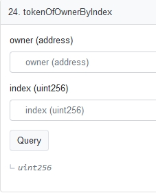
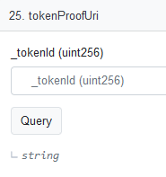
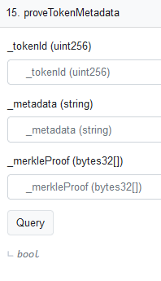
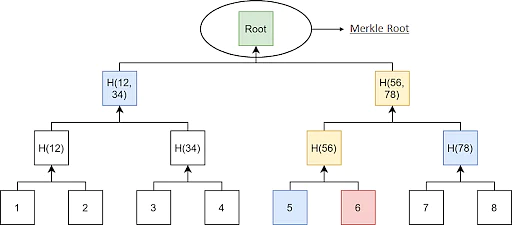

Now that minting has started on [Pixel Cats](https://www.pixel-cats.art), owners might want to know how to verify that their cat is contained within the preset provenance hash. There are two ways you could do this - on-chain or off-chain.

## On-Chain

Head over to the [contract](https://ftmscan.com/address/0x2bB70b039b6516AC754eA1de7A0F75C92069d74F#readContract) on FTMScan and find your token id by entering your address and 0 as the index on the `tokenOfOwnerByIndex` function. Press the query button and it will return the token id that you own.



Next you can get the merkle tree proofs needed to match up by putting the token id that you own into the `tokenProofUri` function.



The returned string is an IPFS url along the lines of `ipfs://QmZoCZU7QiY9nbwkwB1kzDjkmxxSJgXiUXw7NCTuv1yKQc/proof.<TOKEN_ID>.json`. In order to view this url in the browser, simply copy and paste the string into your nav bar and replace `ipfs://` with `https://www.pixel-cats.art/ipfs/`. The full url should be `https://www.pixel-cats.art/ipfs/QmZoCZU7QiY9nbwkwB1kzDjkmxxSJgXiUXw7NCTuv1yKQc/proof.<TOKEN_ID>.json` where `<TOKEN_ID>` is the token id that you own.

The resulting information is the proof needed to verify that your token matches the provenance on-chain.

Enter the information into the `proveTokenMetadata` function on FTMScan as follows:



1. Put your token id into the `_tokenid` field.
2. Put the metadata string from the proof json into the `_metadata` field.
3. Put the array of bytes from the proof json into the `_merkleProof` field (e.g. for token id 674 the proof is `[0x33a92d51e5c60beb90c76d07b6a01dc4979a4efc4b77d9ca6938c4410cf4f104, 0x83e9f2a18b4a1eaaea047b94337e3ef081a2b6078f59ed2ffc475aa29234de09, 0x4ce42a0b2dd408e4a7c57ff102fbfecf0c63ed4cae45a8df101ace6d0b8349fb, 0x47937d99586b2ae6839f03d76d830076361aa65788f8946639d0e02024d876e0, 0x90ac27f6e9767c9079c3ddb3f8727f9668792a0f6aa8f29bf40be10a67dce0c8, 0x82b061ea7c8a3101acf1e4e73fb91ba94df9812bc78325665e7d26586458e1a7, 0xaaafa30294d1ceed59febef61d88ac58d42dca0ae8acca248fbef48beb900d9c, 0x81f60cc2e94944f6170b379fcf601dac66e43c7e4135705990317cd431905fab, 0xfc9453ff934ce7281eb5455a7c4dbaa8003d8ef78008a48313387ddec66b13f9, 0xd8681c2f47ac67bc52d3b776f348fb3a2a72b646c2c7ed787c86f291aacca34c]`).

Note that you should remove the double quotes when putting in the data into the fields. The resulting value will be true if it matches the provenance hash, and false if it has changed. If false that means that the token data has been changed and cannot be trusted since it no longer matches the original data.

## Off-chain

So you can verify the data on-chain, but how do you know that the proof itself and the hashed metadata is correct? We can do that quite simply by running a small script your machine.

### Find the hash of the metadata

Firstly grab your metadata from the above contract by using the `tokenURI` read function and replacing the ipfs url as shown above. Right click on the resulting json and `Save Page As...` to your local file system. We will use this file to verify that the metadata matches the value in the proof.

We're going to use NodeJS to verify the metadata. There are many tutorials out there to get started with Node but the basic script to run is as follows:

```javascript
import { utils } from 'ethers'

const json = require(`FILE_LOCATION_OF_METADATA_JSON`) // this is the metadata json that we just downloaded
const hash = utils.solidityKeccak256(['string'], [JSON.stringify(json)])
console.log(hash)
```

The resulting output will be the metadata string in the proof object that we looked at earlier. 

### Generate the provenance hash

Pixel Cats uses a merkle tree to generate the provenance, which means that each part of the proof is needed to generate the next level in the tree. A merkle tree is an efficient storage method as you do not need the information of the entire tree to verify a single part. As an example in the following image assume you have token id 6. In order to get to the merkle root (i.e. the provenance hash), you need you to hash the metadata of token 5 and 6 together to generate H(56), then use that with H(78) to generated H(56,78), etc. The proof included in the proof json we looked at earlier is each of the blue nodes that we need to generate the provenance hash. 



So let's generate the provenance from our merkle proofs:

```javascript
import { utils } from 'ethers'

const proof = [] // put your proofs in here (in quotes)
const metadataHash = '' // this is the hash we just generated in the previous example
const tokenId = 0 // change to your token id that matches the metadata

let hash = utils.solidityKeccak256(['uint', 'string'], [parseInt(tokenId, 10), metadataHash])
let path = parseInt(tokenId, 10) - 1

for (const p of proof) {
    if ((path & 0x01) == 1) {
        hash = utils.solidityKeccak256(['bytes32', 'bytes32'], [p, hash])
    } else {
        hash = utils.solidityKeccak256(['bytes32', 'bytes32'], [hash, p])
    }
    path /= 2
}

console.log(hash)
```

The output should match the provenance listed on the contract. But what about verifying that the proofs themselves are correct? Then you'd need to do the same thing as we did above for **every** token id and create the entire merkle tree. That's a bit out of scope for this exercise and this is not the only way to verifiably produce a provenance hash. BAYC used a more simple method whereby you could concatenate the hashes of all tokens and generate a hash from the string, and you can come up with your own method if you want.

## Caveats

The keen eyed reader might notice that the IPFS urls are public and browseable. The rarity information is also stored in the same directory as the normal metadata, making it possible for someone to scrape all the metadata and find the highest value/rarest tokens. This is done intentionally for a number of reasons:

1. Show people the tradeoffs they might need to make between simplicity and fair distribution, and how rarity information can be used to attack less hardened projects.
2. Show how the project can be improved by having a `setBaseURI` function and setting it to a new IPFS directory containing the rarity information once minting is complete.
3. For this project it's not as necessary to completely hide the rarity information as currently there's no intrinsic value yet to the token.

Any questions or suggestions then let us know on [Twitter](https://twitter.com/archmagefi_)!